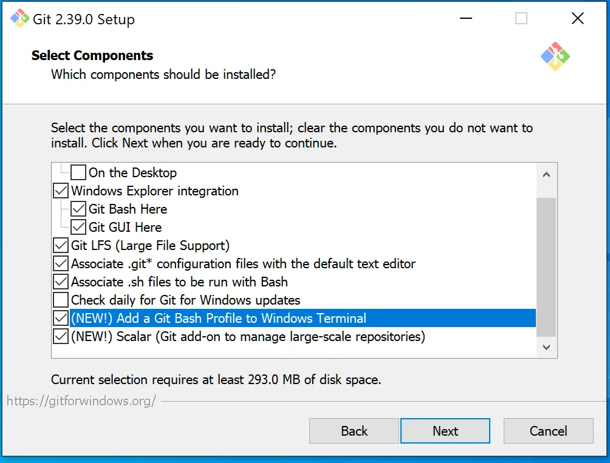
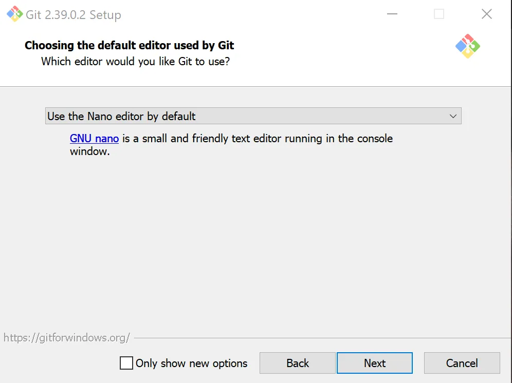
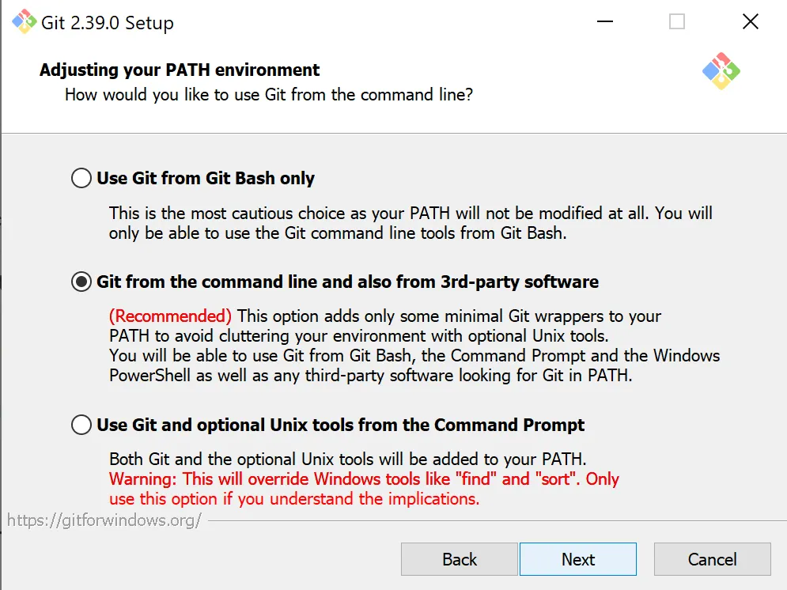
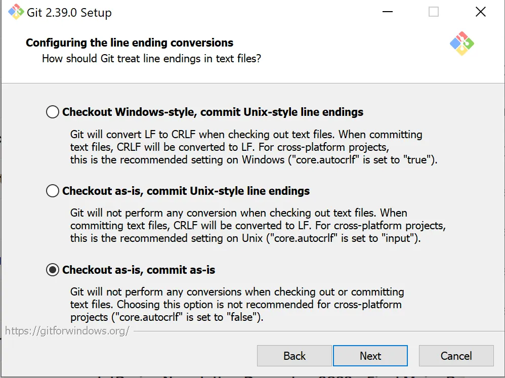
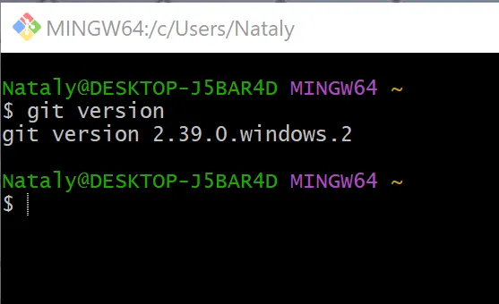
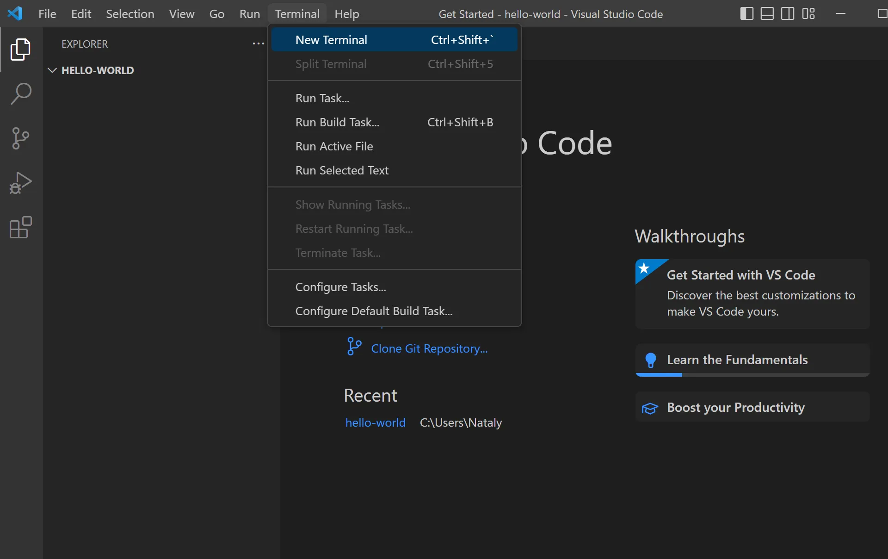
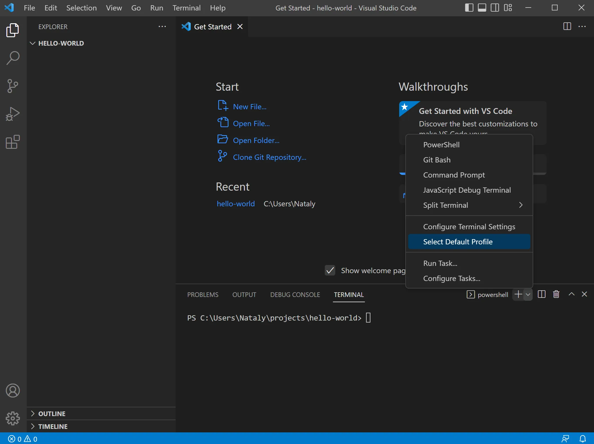
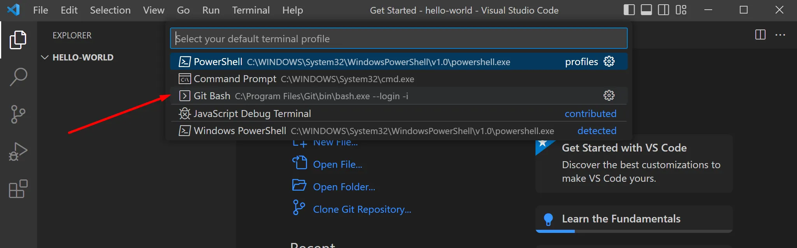
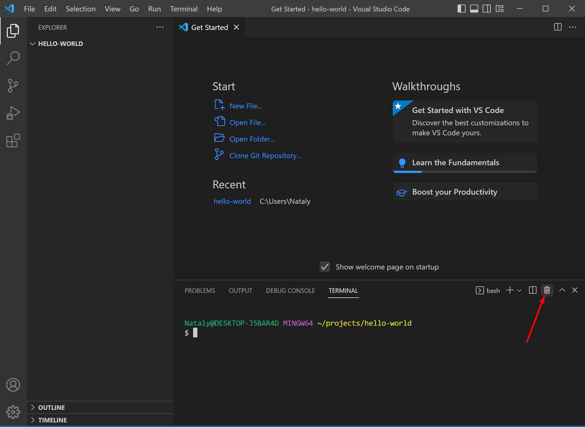

### Инструкция по установке Git на Windows

1. **Скачайте установочный файл Git**  
   Загрузите последнюю версию Git для Windows с официального сайта. Рекомендуется выбрать 64-битную версию.

2. **Запустите установочный файл**  
   Запустите файл обычным двойным кликом, **не используйте запуск от имени администратора**.

3. **Выбор компонентов**  
   Дойдите до шага **Select Components**. На этом этапе:  
   - Убедитесь, что выбраны все компоненты в разделе **Windows Explorer integration**.  
   - Также выберите опцию **Add a Git Bash Profile to Windows Terminal**.

4. **Выбор текстового редактора по умолчанию**  
   На шаге **Choosing the default editor used by Git**, выберите опцию **Use the Nano editor by default**.

5. **Настройка переменной PATH**  
   На шаге **Adjusting your PATH environment**, убедитесь, что выбрана рекомендованная опция (обычно это **Git from the command line and also from 3rd-party software**).

6. **Настройка перевода окончаний строк**  
   На шаге **Configuring the line ending**, выберите последний вариант: **Check out as-is, commit as-is**.

7. **Завершение установки**  
   После завершения установки:  
   - Убедитесь, что стоит галочка на пункте **Launch Git Bash**.  
   - Нажмите кнопку **Finish**, чтобы запустить Git Bash.

8. **Проверка установки**  
   В открывшемся терминале **Git Bash** выполните команду:  
   ```bash
   git --version
   ```  
   Нажмите **Enter**. Если Git установлен правильно, вы увидите текущую версию программы.

9. **Использование Git Bash**  
   Для всех команд и работы с Git в будущем всегда используйте **Git Bash**, а не стандартные терминалы Windows. Это поможет избежать возможных проблем с совместимостью.

### Настройка Git Bash как терминала по умолчанию в Visual Studio Code

1. **Откройте терминал в VSCode**  
   В меню Visual Studio Code выберите:  
   **Terminal -> New Terminal**.

2. **Выбор профиля терминала**  
   Нажмите на стрелку рядом с кнопкой **+** в окне терминала.  
   Выберите опцию **Select Default Profile**.

3. **Выбор Git Bash**  
   В открывшемся списке профилей выберите **Git Bash**.

4. **Перезапуск терминала**  
   - Закройте терминал с помощью кнопки с изображением корзины (справа в области терминала).  
   - Затем снова откройте терминал (кнопка **+**).

5. **Проверка настройки**  
   - В верхней части терминала должно отображаться слово **bash**.  
   - Вы увидите знакомые цвета и интерфейс Git Bash.

Теперь терминал **Git Bash** настроен как профиль по умолчанию в VSCode