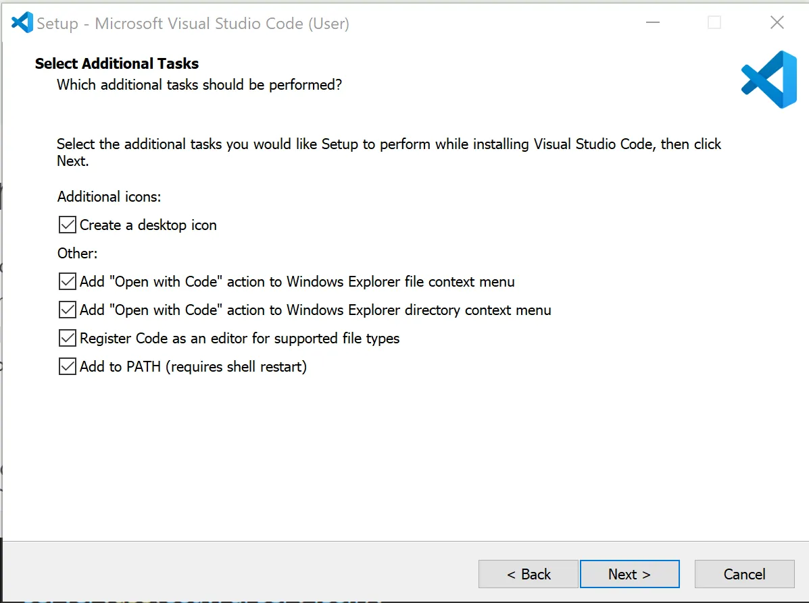

### Установка Visual Studio Code на Windows

1. **Скачайте Visual Studio Code**  
   Перейдите на [официальный сайт](https://code.visualstudio.com/) и скачайте последнюю версию VSCode для Windows.

2. **Запустите установочный файл**  
   Дважды кликните на загруженный файл, чтобы начать установку. **Не запускайте его от имени администратора.**

3. **Следуйте инструкциям установщика**  
   Примите лицензионное соглашение (**I accept the agreement**) и нажмите **Next**.

4. **Выбор дополнительных задач (Select Additional Tasks)**  
   На этом шаге выберите следующие опции:  
   - **Add "Open with Code" action to Windows Explorer file context menu** — позволяет открывать файлы правой кнопкой мыши через контекстное меню.  
   - **Add "Open with Code" action to Windows Explorer directory context menu** — позволяет открывать папки правой кнопкой мыши через контекстное меню.  
   - **Register Code as an editor for supported file types** — делает VSCode редактором по умолчанию для поддерживаемых файлов.  
   - **Add to PATH** — добавляет VSCode в системную переменную PATH, чтобы запускать редактор через команду `code` в терминале.  

5. **Завершение установки**  
   Нажмите **Install**, дождитесь завершения процесса и нажмите **Finish**.

---

### Проверка работы PATH

1. Откройте **Git Bash**, **PowerShell** или любой терминал.  
2. Выполните команду:  
   ```bash
   code --version
   ```  
   Если команда вернула версию VSCode, то PATH настроен правильно.

---

Теперь Visual Studio Code установлен и готов к работе